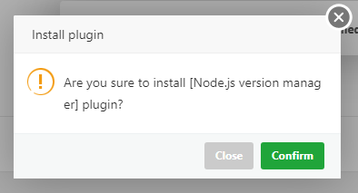

# Ubuntu 22.04

## install curl and wget
```bash
sudo apt update && sudo apt install -y curl wget
```

## install aapanel

- Visit the [https://www.aapanel.com/new/download.html](https://www.aapanel.com/new/download.html)
- Copy and run the `aaPanel Free edition install script`
- Once the installation is complete, save your `aaPanel Internet Address`, `username`, and `password`
- Log in to your `aapanel`
- Click `Finish`


- Ensure all options are selected as shown in the screenshot below, then click `One-click` under `LAMP`


- Wait for the process to complete


- Or manually reload the page, then navigate to your `IP Address` -> `Task list` and check for the message `Currently no tasks!` which indicates that the process is complete


## install node.js

- Navigate to `Website` -> `Node Project` -> `Install`


- Click `Confirm`



- Click `Install` to begin the process


- Once `Installation suceeded!` shows, go to `Node version manager` -> `Update version list` and install the latest `Stable Version`


- A `Sucessful installation` will look like this


## setup node.js project

- Navigate to `Files` -> `Root dir > www > wwwroot` create a folder for your project in this directory


- Inside the folder you created, upload your `.zip` file, then `Unzip` it
- After `Unzip` remember to delete the `.zip` file
- Navigate to `Website` -> `Node Project` -> `Add Node Project`
  - Choose the folder `Path` where your project resides
  - Enter a `Name` for your project
  - For the `Port` enter 1 (you can edit this later)
  - Enter your `Domain name`
  - Click `Confirm`


- Click on your app `Name` -> `Project log` to identify the port your project is running on


- Navigate to `Project config` and update the port to match the one shown in `Project log`


- Before setting up `SSL` ensure that your domain `A` record point to your server `IP Address`
- Navigate to `SSL` -> `Let's Encrypt` -> `File verification` -> `Select All` -> click `Apply`


